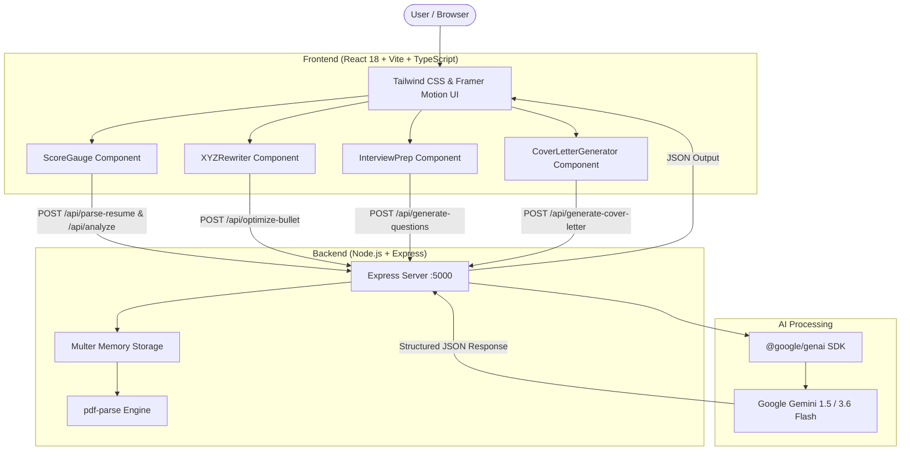

# ResumeBoost ⚡ AI-Powered Resume & Career Accelerator

<p align="center">
  
  
  
  
  
  
  
  
</p>

---

## 📌 Overview

**ResumeBoost** is an all-in-one, AI-driven career acceleration platform designed to help job seekers bypass Applicant Tracking Systems (ATS) and land more interviews. Powered by Google Gemini AI, ResumeBoost analyzes resumes against job descriptions, highlights missing keywords, rewrites achievements into high-impact Google XYZ bullet points, generates targeted interview preparation strategies, and crafts bespoke cover letters in seconds.

---

## 🚀 Key Features

### 1. 🎯 ATS Resume Match Analyzer
- **PDF Upload & Parsing**: Direct PDF drag-and-drop parsing or direct text pasting.
- **Match Scoring**: Dynamic visual gauge displaying match score (0–100%).
- **Keyword Gap Analysis**: Clear visual breakdown of **Matched Keywords** vs. **Missing Keywords** required by the job description.
- **Actionable Feedback**: Concrete recommendations to optimize ATS compatibility before applying.

### 2. ⚡ Google XYZ Formula Rewriter
- Transforms vague, passive resume bullet points into high-converting statements using Google's proven framework:
  > *"Accomplished **[X]** as measured by **[Y]**, by doing **[Z]**"*
- Color-coded interactive pills highlighting **Action ([X])**, **Metric ([Y])**, and **Method ([Z])**.
- Generates 3 diverse variations per bullet point with one-click copy.

### 3. 💼 AI Interview Preparation Coach
- Analyzes candidate experience directly against the target job description to generate 5 targeted interview questions:
  - **Technical Questions**: In-depth questions testing specific tools and domain systems.
  - **Behavioral Questions**: Scenario-based evaluation (teamwork, leadership, problem solving).
  - **Resume-Gap Questions**: Directly addresses potential skill gaps or ambiguities.
- Includes **"Why Asked"** context, **"Answer Strategy"** (STAR method guidance), and **"Sample Answers"**.

### 4. ✍️ Dynamic AI Cover Letter Generator
- **Multi-Tone Engine**: Choose between **Professional**, **Modern**, **Concise**, and **Enthusiastic** tones.
- **Targeted Personalization**: Optional company name and hiring manager customization.
- **Email Subject Line Generation**: High-converting subject lines ready for direct email outreach.
- **Key Highlights Extraction**: Summarizes woven resume strengths for quick review.
- **Instant Export**: Export directly to `.txt` or `.doc` formatted documents.

---

## 🏗️ System Architecture



---

## 📁 Repository Structure

```
Resume-Analyzer/
├── backend/
│   ├── .env.example            # Environment variables template
│   ├── package.json            # Backend dependencies & scripts
│   └── server.js               # Express API with Gemini endpoints & PDF parser
├── frontend/
│   ├── public/                 # Static assets
│   ├── src/
│   │   ├── components/
│   │   │   ├── CoverLetterGenerator.tsx  # Multi-tone cover letter generator & exporter
│   │   │   ├── InterviewPrep.tsx         # AI interview coach & sample answers
│   │   │   ├── ScoreGauge.tsx            # Animated SVG match score gauge
│   │   │   └── XYZRewriter.tsx           # Google XYZ formula bullet point optimizer
│   │   ├── App.tsx             # Main dashboard & tab router
│   │   ├── index.css           # Tailwind CSS imports & animations
│   │   └── main.tsx            # React entry point
│   ├── index.html
│   ├── package.json            # Frontend dependencies & scripts
│   ├── tsconfig.json           # TypeScript configuration
│   └── vite.config.ts          # Vite configuration
├── package.json                # Root package for workspace scripts
└── README.md                   # Project documentation
```

---

## 🔌 API Endpoints

| Method | Endpoint | Description | Request Body / Payload |
|---|---|---|---|
| `GET` | `/api/health` | Healthcheck & Gemini API status | None |
| `POST` | `/api/parse-resume` | Extracts text from uploaded PDF | `multipart/form-data` (`file`: PDF) |
| `POST` | `/api/analyze` | Calculates ATS match, keywords & feedback | `{ resumeText, jobDescription }` |
| `POST` | `/api/optimize-bullet` | Rewrites bullet using Google XYZ formula | `{ bulletPoint, jobContext }` |
| `POST` | `/api/generate-questions` | Generates 5 tailored interview questions | `{ resumeText, jobDescription }` |
| `POST` | `/api/generate-cover-letter` | Generates tailored cover letter | `{ resumeText, jobDescription, tone, companyName, hiringManager }` |

---

## 🛠️ Getting Started

### Prerequisites
- [Node.js](https://nodejs.org/) (v18.0.0 or higher recommended)
- [npm](https://www.npmjs.com/) (v9.0.0 or higher)
- A **Google Gemini API Key** (from [Google AI Studio](https://aistudio.google.com/))

---

### 1. Clone the Repository
```bash
git clone https://github.com/msubhank/Resume-Boost.git
cd Resume-Analyzer
```

---

### 2. Backend Setup
1. Navigate to the backend directory:
   ```bash
   cd backend
   ```
2. Install dependencies:
   ```bash
   npm install
   ```
3. Create a `.env` file from the example template:
   ```bash
   cp .env.example .env
   ```
4. Open `.env` and insert your Gemini API Key:
   ```env
   PORT=5000
   GEMINI_API_KEY=your_gemini_api_key_here
   ```
5. Start the backend server:
   ```bash
   npm run dev
   ```
   *The server will start on `http://localhost:5000`.*

---

### 3. Frontend Setup
1. Open a new terminal and navigate to the frontend directory:
   ```bash
   cd frontend
   ```
2. Install dependencies:
   ```bash
   npm install
   ```
3. Start the Vite development server:
   ```bash
   npm run dev
   ```
   *The frontend will start on `http://localhost:5173`.*

---

## 💻 Tech Stack

- **Frontend**: React 18, TypeScript, Vite, Tailwind CSS, Framer Motion, Lucide Icons, Canvas Confetti
- **Backend**: Node.js, Express.js, Multer (Memory Storage), `pdf-parse`
- **AI Engine**: Google Gemini API (`@google/genai`) with structured JSON schema outputs

---

## 📄 License

This project is licensed under the MIT License. Feel free to use, modify, and distribute it as needed.
